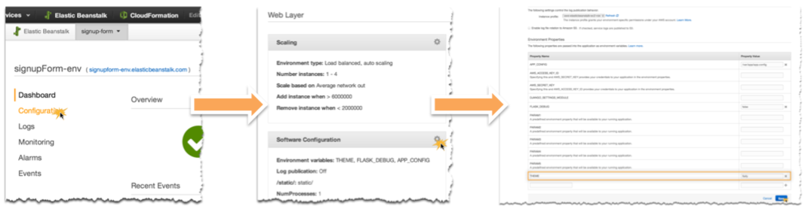

# eb-py-flask-signup
This repository contains a basic Python application built using the Flask framework and Bootstrap to demonstrate some of [AWS Elastic Beanstalk](http://aws.amazon.com/elasticbeanstalk/) features. 

The application stores data in [Amazon DynamoDB](http://aws.amazon.com/dynamodb/) and publishes notifications to the [Amazon Simple Notification Service (SNS)](http://aws.amazon.com/sns/) when a customer fills out the form.

We will be looking at how to deploy and manage a blue green deployment within Beanstalk as well as some of the features Beanstalk offers.

## Features

### Themes
The code includes several Bootstrap themes from [bootswatch.com](http://bootswatch.com/). You can dynamically change the active theme by setting the THEME environment variable in the [Elastic Beanstalk Management Console](https://console.aws.amazon.com/elasticbeanstalk):

Installed themes include:

* [amelia](http://bootswatch.com/amelia)
* [default](http://bootswatch.com/default)
* [flatly](http://bootswatch.com/flatly)
* [slate](http://bootswatch.com/slate)
* [united](http://bootswatch.com/united)

### Flask Debugging
Similar to themes, you can control Flask debugging by toggling the FLASK_DEBUG env var from the [Elastic Beanstalk Management Console](https://console.aws.amazon.com/elasticbeanstalk).
