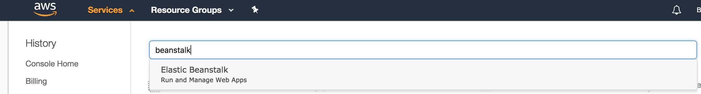

# Hands On

First we need to login into the console with the provided credentails, additionally ensure that we are in the eu-west-1 (Ireland) region. https://ecsd-training.signin.aws.amazon.com/console


Contained within this repository we have a cloudformation script which will create the underlying supporting infrastructure this application takes advantage of. As this demonstration is on Beanstalk we won't be looking at this script in too much detail and the host will run this cloudformation script before hand.

1. Change your region to Ireland and select the AWS Beanstalk service from the services tab



2. From the top right hand corner select 'Create New Application' and fill in the details with the format %firstname%-%surname%-app


3. Next we want to create an environment. As we are going to perform a blue-green deployment we will want to name this %firstname%-%surname%-blue. To do this select the 'Actions' dropdown in the top right corner and select Create environment.


4. Once in this screen we have some decisions to make. We can choose between a web server environment or a worker environment. We will be working with the web server environment today, as a result select this.


5. Now we have a few things to configure, namely: environment name, domain, platform, application code. We want to follow the same format as before where we are prefixing %firstname%-%surname% to ensure it is unique. 
- For the environment use %firstname%-%surname%-blue
- For the domain use %firstname%-%surname%-production.
- For the platform select docker as that is the platform we are using


6. Next we want to upload our code. To do this we first need to download the code, the initial batch of code is avaliable as a download in the releases tab of this repository. Once downloaded we will want to go back to our beanstalk tab and select upload. On the side bar select the choose a file option and navigate to your .zip file (the file downloaded from GitHub). lastly update the version label to %firstname%-%surname%-1. This is the version that gets assocaited with this package i.e. a release number. Now hit 'upload'. 

7. Select 'Configure more options'. We are now presented a range of configuration options. For our deployment we will be keeping it simple, as a result we will be only changing the security configuration to allow the application to access some of the reasons it uses. To do this select 'modify' under the security section.

8. We want to update the the IAM instance profile to use the pre-created pofile 'beanstalk-playground-ec2' and hit save. This profile contains permissions for SNS, DynamoDB and SQS allowing the application to make use those AWS resources.


9. Now we can deploy our environment, to do this hit create environment. The initial deployment of an environment can take 5 minutes to complete.

10. Once the deployment is done you should be presented with a screen like below. We can prove it has worked by loading the URL.


11. Next we want to create our green environment. We can achieve this by going through the same process or by using Beanstalks clone environment feature. This can be accessed from the Actions dropdown. Once selected we have some configuration to do. Set the environment name to be %firstname%-%surname%-green and the URL to %firstname%-%surname%-inactive. 

Once configured hit 'clone'.


12. Wait for the deployment to complete

13. We now need now make a change to our code and deploy that code to our green environment. Navigate to where you downloaded the file, make a folder called playground and move the zip file into that folder. Now expand the zip file and open the directory structure in your favourite editor, for instance Visual Code. We want to make some code changes now so we have a difference to deploy. In your editor navigate open index.html and replace the uncommented line with the commented out line

From this:
```
          <li><a href="#">Press</a></li>
          <!-- <li><a href="/press">Press</a></li> -->
```
to this:
```
          <li><a href="/press">Press</a></li>
```

Additionally lets make a text change, lets update the title of the index page.

from this:
```
    <title>A New Startup: Sign Up Today!</title>
```
to this:
```
    <title>Get To The Choppa!</title>
```

14. No we have made our changes we need to package our release unit up into a format that Beanstlak can work with. We do this by zipping everything up at the root on our project. How you do this will depend on your OS. For Mac / Linux you can do this via terminal. In terminal change directory to where you project resides and then zip it up like so `zip -r  callum-tait-archive.zip .`. However you achieve this ensure that you include the .ebextensions folder which is a hidden folder.
 - Note if you did clone the repository instead of download the provided release ensure that you exclude the .git folder from your zip process `zip -r callum-tait-archive.zip . -x *.git*`

15. Now we have a change we want to deploy this change to Beanstalk. As this is a blue-green deployment we first want to deploy our code to our site that our customers are NOT using, this would be our green environment. Navigate to your green environment and select 'upload and deploy'. Ensure you provide a version label, seen as this is a 2nd version increment your previous verion label i.e. %firstname%-%surname%-2.


16. Hit deploy and wait for the deployment to complete. Once done check that your code changes can be seen by loading the site again.

17. Now we want to swap our environment URLs around so our original blue environment (which is the URL our customers are using) points to our green environment and vice versa. 


18. Once Beanstalk reports success try loading the new green environment URL present (which was the blue environments URL (%firstname%-%surname%-production)). Now test to see if your changes are present. Congratualtions you have done a blue green deployment! Subsequently when you had a new release you would deploy this to your blue environment and swap the URLs again. 

